# Jenkins Code Coverage Plug-in

[](https://gitter.im/jenkinsci/code-coverage-api-plugin?utm_source=badge&utm_medium=badge&utm_campaign=pr-badge)
[](https://plugins.jenkins.io/code-coverage-api)
[](https://ci.jenkins.io/job/Plugins/job/code-coverage-api-plugin/job/master/)
[](https://github.com/jenkinsci/code-coverage-api-plugin/actions)
[](https://codecov.io/gh/jenkinsci/code-coverage-api-plugin/branch/master)
[](https://github.com/jenkinsci/code-coverage-api/actions/workflows/codeql.yml)

The Jenkins Code Coverage Plug-in collects reports of code coverage or mutation coverage tools. It has support for the following report formats:

- [JaCoCo](https://www.jacoco.org/jacoco)
- [Cobertura](https://cobertura.github.io/cobertura/)
- [PIT](https://pitest.org/)

If your coverage tool is not yet supported by the code coverage plugin you can provide a pull request for the [Coverage Model](https://github.com/jenkinsci/coverage-model/pulls).

The plugin publishes a report of the code coverage and mutation coverage in your build, so you can navigate to a summary report from the main build page. From there you can also dive into the details:
- tree charts that show the distribution of coverage by type (line, instruction, branch, method, class, etc.)
- tabular listing of all files with their coverage 
- source code of the files with the coverage highlighted
- trend charts of the coverage over time

This project was part of [GSoC 2018](https://jenkins.io/projects/gsoc/2018/code-coverage-api-plugin/).

## Features

The code coverage plug-in provides the following features when added as a post build action (or step) to a job:

* Coverage analysis of projects and pull requests: The plugin now computes and shows the absolute coverage of the project, the coverage of the modified files and the coverage of the modified lines, so you can see how the changes actually affect the code coverage. Additionally, the delta values of these coverages with respect to the reference build are computed and the coverage changes created by changed test cases (indirect coverage changes).

 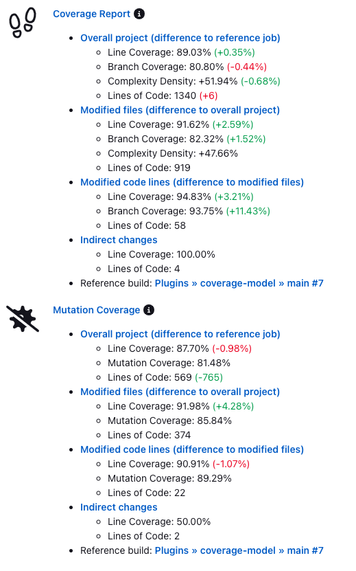

* Coverage overview and trend:

  
  
* Colored project coverage tree map for line, branch, instruction and mutation coverage:

  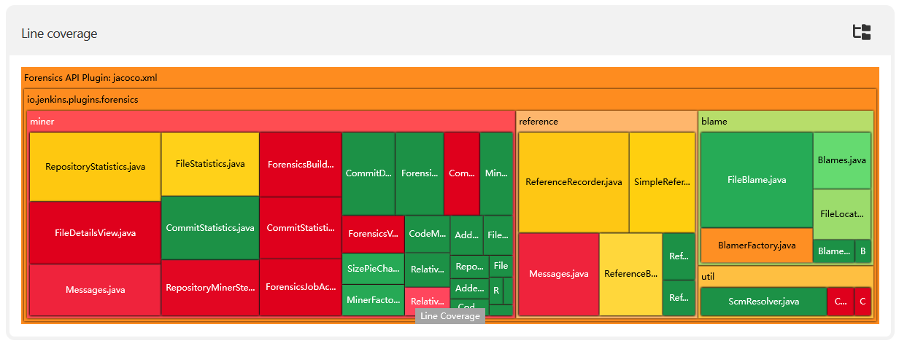
  
* Source code navigation with a configuration option to store the source code files for all builds, for current build only, or for changed files only:

  
  
* Specific source code view for analyzing the coverage of changed code lines:

  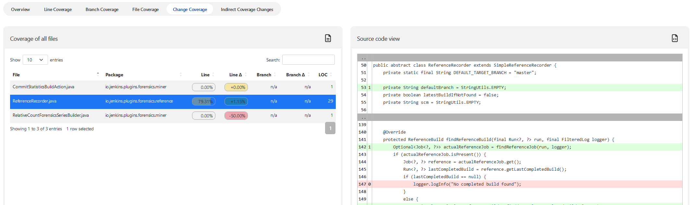
   
* Specific source code view for analyzing the coverage changes that are a result of test changes (indirect coverage changes):

  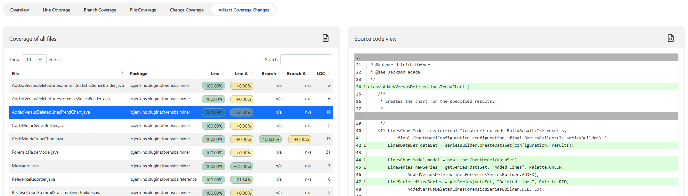

* Customizable coverage overview for the Jenkins dashboard view and for build results:

  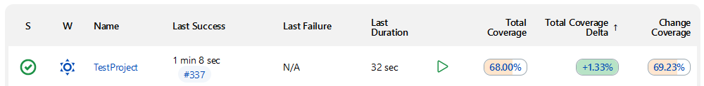

* Quality Gates: You can specify an arbitrary number of quality gates that allow to set the build to unstable or failed if the thresholds are not met. For each quality gate the metric (branch coverage, complexity, etc.) and the baseline (whole project, changed files, etc.) can be defined.

  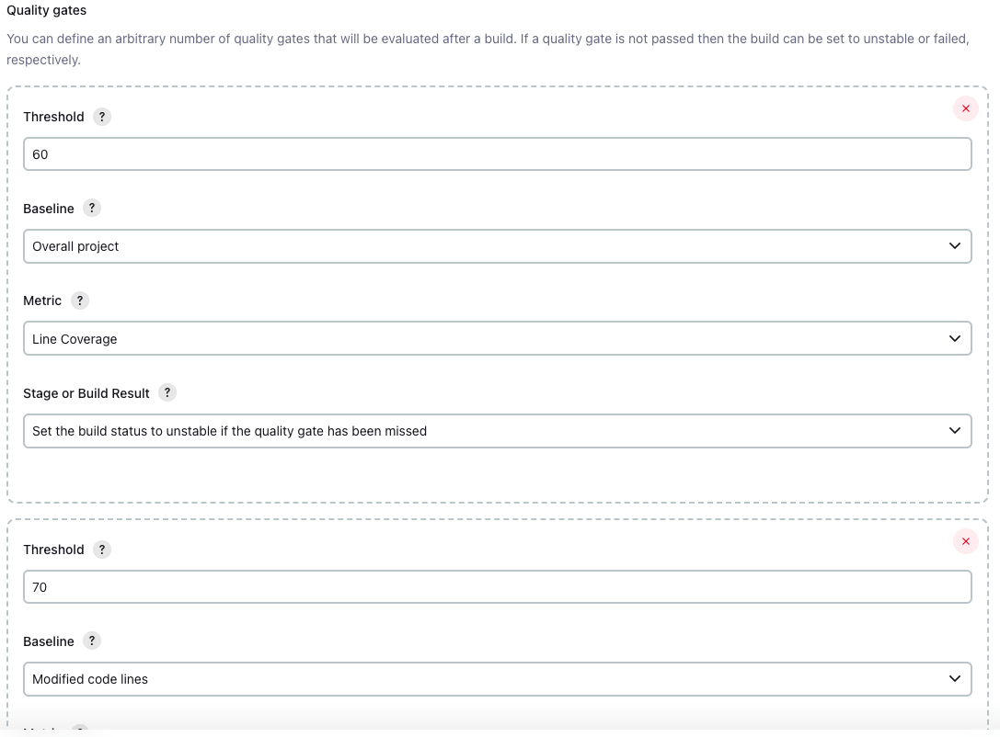

* Quality gate result: The detailed result of the quality gate evaluation is available as tooltip in the build summary:

  

* Cyclomatic Complexity and LOC metrics: Several coverage parsers support the measurement of cyclomatic complexity and lines of code. These metrics are now computed and recorded as well:

  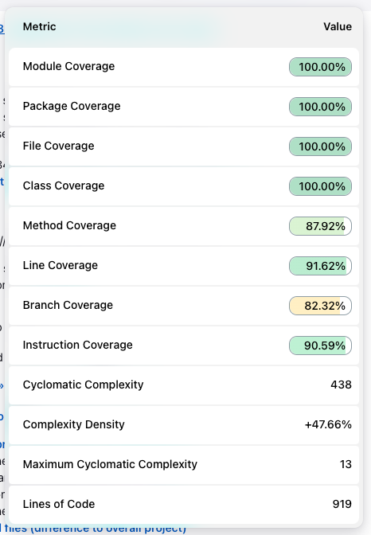

* The recorder has been extended with a native step that is capable of setting the step status (unstable, failed, ok):

  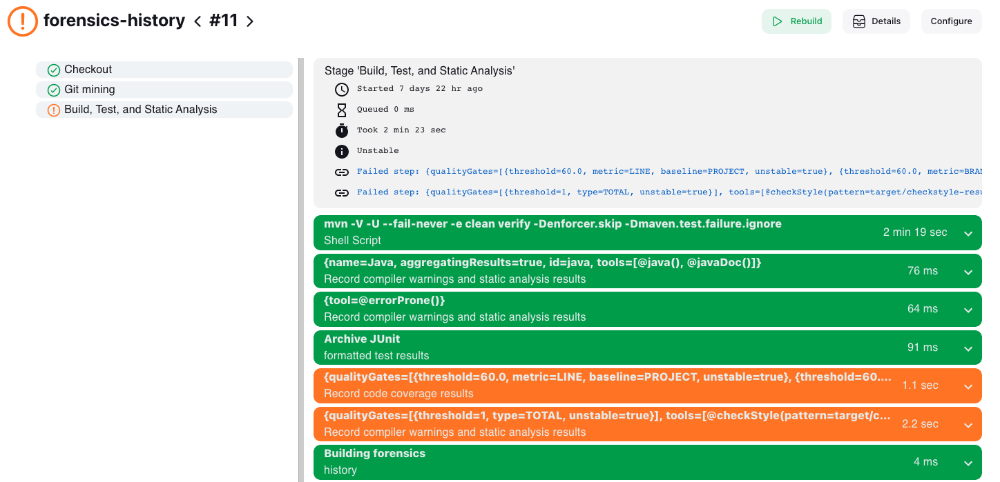

* GitHub checks report to show the detailed line and branch coverage results for pull request:

  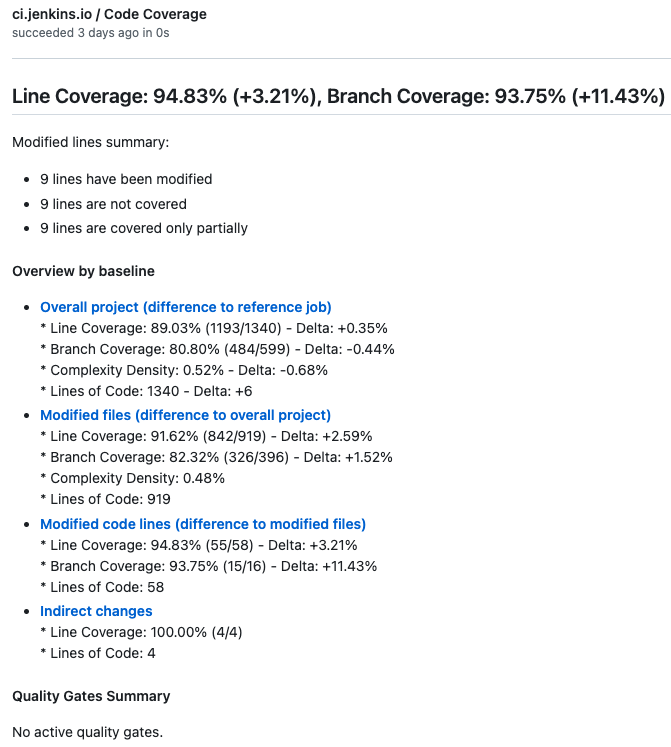
  

* GitHub checks report to show the detailed line and mutation coverage results for pull request:

  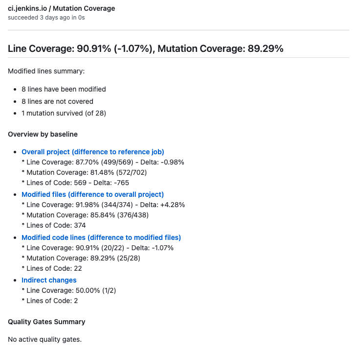
  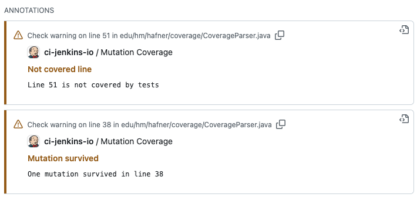


## Usage

:exclamation: The plugin does not run the code coverage, it just visualizes the results reported by such tools. You still need to enable and configure the code coverage tool in your build file or Jenkinsfile. :exclamation:

### Supported project types

The Code Coverage Plug-in supports the following Jenkins project types:

- Freestyle Project
- Maven Project
- Scripted Pipeline (sequential and parallel steps)
- Declarative Pipeline (sequential and parallel steps)
- Multi-branch Pipeline

#### Freestyle project 

Enable the "Record code coverage results" publisher in the Post-build Actions section of your job. Select at least one coverage tool and specify the path to the report file. If you do not specify a path, the plugin will search for the report file in the workspace using the default pattern of the tool. 

:info: Since version 4.0.0 the old step "Publish code coverage results" has been marked as deprecated. This old step uses a deprecated internal model and is not supported anymore. Please migrate your jobs to the new step in order to improve from the new features of the plugin.

#### Pipeline example

The recording step also supports pipeline configuration (scripted or declarative). The simplest way to generate the corresponding pipeline code is by using Jenkins' Snippet Generator: there you can configure all available properties of the step by using a rich user interface with inline help and validation. A sample step definition is given in the following code snippet. This step records coverage results of JaCoCo with the default file name pattern. The coverage information is rendered with the source code for every build, and quality gates have been set up for line and branch coverages. I.e., if the line or branch coverage does not reach the threshold of 60%, then the build will be marked as unstable.

```groovy
recordCoverage(tools: [[parser: 'JACOCO']],
        id: 'jacoco', name: 'JaCoCo Coverage',
        sourceCodeRetention: 'EVERY_BUILD',
        qualityGates: [
                [threshold: 60.0, metric: 'LINE', baseline: 'PROJECT', unstable: true],
                [threshold: 60.0, metric: 'BRANCH', baseline: 'PROJECT', unstable: true]])
```

## Reference build (baseline)

One unique feature of the Coverage plugin is the delta computation of coverage metrics with respect to a baseline build (reference build). The plugin reads the results of the reference build and compares these results with the current results: for each coverage metric, a delta value is computed. The delta values are shown as absolute coverages of the project, the coverages of the modified files, or the coverages of the modified lines. This helps to see how the code changes actually affect the code coverage.

In order to compute this classification, the plugin requires a reference build (baseline). When selecting a baseline, we need to distinguish two different use cases, which are documented in the next sections.

### Selecting a baseline from the current job

When a team wants to investigate how the coverage of the project changes over the time, we need to simply look back in the history of the same Jenkins job and select another build that we can use to compare the results with. Such a Jenkins job typically builds the main branch of the source control system. This behavior is available out-of-the-box without any additional configuration. 

### Selecting a baseline in the target job

:warning: This feature requires the installation of an additional plugin:
[Git Forensics Plugin](https://github.com/jenkinsci/git-forensics-plugin).

For more complex branch source projects (i.e., projects that build several branches and pull requests in a connected job hierarchy) it makes more sense to select a reference build from a job that builds the actual target branch (i.e., the branch the current changes will be merged into). Here one typically is interested what changed in the branch or pull request over the main branch (or any other target branch). That means we want to see how the coverage changes when new code will be submitted by a branch or pull request.

If you are using a Git branch source project, the Jenkins job that builds the target branch will be selected automatically by running the reference recorder step. Simply call the step `discoverGitReferenceBuild` before the step to record the code coverage:

```groovy
discoverGitReferenceBuild()
recordCoverage(tools: [[parser: 'JACOCO']])
```

Selecting the correct reference build is not that easy as it looks, since the main branch of a project will evolve more frequently than a specific feature or bugfix branch. That means if we want to compare the results of a pull request with the results of the main branch we need to select a build from the main branch that contains only commits that are also part of the branch of the associated pull request.

Therefore, the Git Forensics plugin automatically tracks all commits of a Jenkins build and uses this information to identify a build in the target branch that matches best with the commits in the current branch. Please have a look at the [documentation of the Git Forensics plugin](https://github.com/jenkinsci/git-forensics-plugin) to see how this is achieved in detail.

This algorithm can be used for plain Git SCM freestyle projects or pipelines as well. In this case, we cannot get the target branch information automatically from the Git branch source API. Therefore, you need to manually specify the Jenkins job that builds the target branch in the parameter `referenceJob`. See the following sample pipeline snippet for an example on how to discover a baseline from such a reference job:

```groovy
discoverGitReferenceBuild referenceJob: 'my-reference-job'
recordCoverage(tools: [[parser: 'JACOCO']])
```

## Remote API

We provide a remote API to retrieve coverage data, using the following URL: `https://[jenkins-url]/job/[job-name]/[build-number]/coverage/api/json?pretty=true`. 

Example output:
```json
{
  "_class" : "io.jenkins.plugins.coverage.metrics.steps.CoverageApi",
  "modifiedFilesDelta" : {
    "branch" : "+1.72%",
    "class" : "-3.54%",
    "complexity" : "-236",
    "complexity-density" : "+0.47%",
    "file" : "+0.00%",
    "instruction" : "+0.16%",
    "line" : "-0.48%",
    "loc" : "-482",
    "method" : "+1.23%",
    "module" : "+0.00%",
    "package" : "+0.00%"
  },
  "modifiedFilesStatistics" : {
    "branch" : "83.91%",
    "class" : "93.33%",
    "complexity" : "392",
    "complexity-density" : "+50.19%",
    "file" : "100.00%",
    "instruction" : "88.19%",
    "line" : "87.96%",
    "loc" : "781",
    "method" : "86.18%",
    "module" : "100.00%",
    "package" : "100.00%"
  },
  "modifiedLinesDelta" : {
    "branch" : "+8.95%",
    "file" : "+0.00%",
    "line" : "+3.85%",
    "loc" : "-610",
    "module" : "+0.00%",
    "package" : "+0.00%"
  },
  "modifiedLinesStatistics" : {
    "branch" : "92.86%",
    "file" : "100.00%",
    "line" : "91.81%",
    "loc" : "171",
    "module" : "100.00%",
    "package" : "100.00%"
  },
  "projectDelta" : {
    "branch" : "+4.43%",
    "class" : "+2.94%",
    "complexity" : "-8",
    "complexity-density" : "+1.28%",
    "file" : "+4.00%",
    "instruction" : "+2.59%",
    "line" : "+3.37%",
    "loc" : "-50",
    "method" : "+1.28%",
    "module" : "+0.00%",
    "package" : "+0.00%"
  },
  "projectStatistics" : {
    "branch" : "82.19%",
    "class" : "96.88%",
    "complexity" : "628",
    "complexity-density" : "+49.72%",
    "file" : "100.00%",
    "instruction" : "88.03%",
    "line" : "88.44%",
    "loc" : "1263",
    "method" : "84.94%",
    "module" : "100.00%",
    "package" : "100.00%"
  },
  "qualityGates" : {
    "overallResult" : "SUCCESS",
    "resultItems" : [
      {
        "qualityGate" : "Overall project - Line Coverage",
        "result" : "SUCCESS",
        "threshold" : 60.0,
        "value" : "88.44%"
      },
      {
        "qualityGate" : "Overall project - Branch Coverage",
        "result" : "SUCCESS",
        "threshold" : 60.0,
        "value" : "82.19%"
      }
    ]
  },
  "referenceBuild" : "<a href=\"http://localhost:8080/job/coverage-model-history/10/\" class=\"model-link inside\">coverage-model-history #10</a>"
}
```
