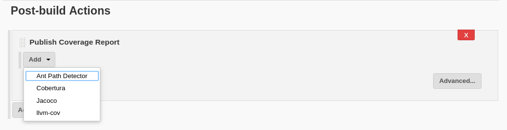
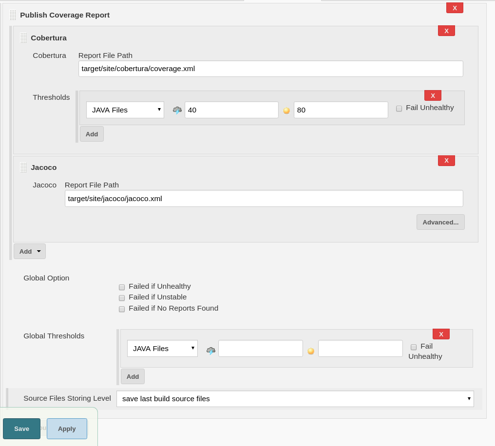

# code-coverage-api-plugin

[](https://gitter.im/jenkinsci/code-coverage-api-plugin?utm_source=badge&utm_medium=badge&utm_campaign=pr-badge)


This plugin serves as API to integrate and publish multiple coverage report types.
More information see [https://jenkins.io/projects/gsoc/2018/code-coverage-api-plugin/](https://jenkins.io/projects/gsoc/2018/code-coverage-api-plugin/).

## Features
* Pipeline support
* Modernized coverage chart
* Coverage trend
* Source code navigation
* Parallel execution in pipeline support
* Reports combining
* REST API
* Failed conditions and flexible threshold setting
* Other small features

## Supported Coverage Formats
#### Embedded
- [JaCoCo](https://www.jacoco.org/jacoco/trunk/doc/)
- [Istanbul](https://istanbul.js.org/) - [Cobertura Reporter](https://istanbul.js.org/docs/advanced/alternative-reporters/#cobertura)
#### Other plugins as an Extension of Code Coverage API plugin
- [Cobertura](http://cobertura.github.io/cobertura/) ([Cobertura Plugin](https://github.com/jenkinsci/cobertura-plugin))
- [llvm-cov](https://github.com/llvm-mirror/clang/blob/master/docs/SourceBasedCodeCoverage.rst) ([llvm-cov plugin](https://github.com/jenkinsci/llvm-cov-plugin))
- [OpenCover](https://github.com/OpenCover/opencover) ([OpenCover Plugin](https://github.com/jenkinsci/opencover-plugin))

## Release Notes
See the [CHANGELOG](CHANGELOG.md).

## How to Implement it
see [wiki](https://github.com/jenkinsci/code-coverage-api-plugin/wiki).
## How to Use it

#####  1. Config coverage tool to generate reports.

Config maven to generate Cobertura coverage reports:
```xml
<build>
    <plugins>
        <plugin>
            <groupId>org.codehaus.mojo</groupId>
            <artifactId>cobertura-maven-plugin</artifactId>
            <version>2.7</version>
            <configuration>
                <formats>
                    <format>xml</format>
                </formats>
                <check/>
            </configuration>
            <executions>
                <execution>
                    <phase>package</phase>
                    <goals>
                        <goal>cobertura</goal>
                    </goals>
                </execution>
            </executions>
        </plugin>
    </plugins>
</build>
```
More information about [Cobertura](http://cobertura.github.io/cobertura/).

Config maven to generate JaCoCo coverage reports:

```xml
<build>
    <plugins>
        <plugin>
            <groupId>org.jacoco</groupId>
            <artifactId>jacoco-maven-plugin</artifactId>
            <version>0.8.1</version>
            <executions>
                <execution>
                    <goals>
                        <goal>prepare-agent</goal>
                    </goals>
                </execution>
                <execution>
                    <id>report</id>
                    <phase>package</phase>
                    <goals>
                        <goal>report</goal>
                    </goals>
                </execution>
            </executions>
        </plugin>
    </plugins>
</build>
```
More Information about [JaCoCo](https://www.jacoco.org/jacoco/trunk/doc/).

Use llvm-cov to generate JSON format report:
```
$ llvm-cov export -instr-profile /path/to/foo.profdata /path/to/foo
```
More Information  [llvm-cov](https://github.com/llvm-mirror/clang/blob/master/docs/SourceBasedCodeCoverage.rst#exporting-coverage-data).

##### 2. Install Jenkins plugins which implement Code Coverage API plugin (cobertura-plugin, llvm-cov-plugin).
##### 3. Enable "Publish Coverage Report" publisher in the Post-build Actions.
##### 4. Add your coverage tool adapter and specify reports path.

##### 5. (Optional) Use the [forensics-api](https://github.com/jenkinsci/forensics-api-plugin) plugin to discover the reference build that is used to compute a delta report of the coverage results. 
##### 6. (Optional) Specify Thresholds of each metrics in global or adapter level.
##### 7. (Optional) Specify Source code storing level to enable source code navigation.


## Pipeline example
We also support pipeline configuration, you can generate pipeline code in Jenkins Snippet Generator.

```groovy

publishCoverage adapters: [jacocoAdapter('target/site/jacoco/jacoco.xml')]

```
You can also use `jacoco` instead of `jacocoAdapter` if you didn't install Jacoco-Plugin.

##### Parallel Pipeline Support
We support parallel pipeline. You can call the Code Coverage API plugin in different branches like this:
```groovy
node {
    parallel firstBranch: {
        publishCoverage adapters: [jacocoAdapter('target/site/jacoco/jacoco.xml')]
}, secondBranch: {
        publishCoverage adapters: [jacocoAdapter('jacoco.xml')]
    }
}
```
##### Reports Combining Support
You can add tag on publishCoverage and Code Coverage API plugin will combine reports have same tag:

```
node {
    parallel firstBranch: {
        publishCoverage adapters: [jacocoAdapter('target/site/jacoco/jacoco.xml')], tag: ‘t’
}, secondBranch: {
        publishCoverage adapters: [jacocoAdapter('jacoco.xml')], tag: ‘t’
    }
}
```
##### Merging Reports
There is also a possibility to merge multiple reports (e.g. from multiple xml files) into one using the `mergeToOneReport` option with an ant-style path pattern.
All reports found by the adapter will then be combined into a single report:

```
publishCoverage adapters: [jacocoAdapter(mergeToOneReport: true, path: '**/*.xml')]
```
## REST API
We provide a REST API to retrieve coverage data:
- Coverage result: `…​/{buildNumber}/coverage/…​/result/api/\{json|xml\}?depth={number}`
- Trend result: `…​/{buildNumber}/coverage/…​/trend/api/\{json|xml\}?depth={number}`
- Coverage result of last build: `…​/{buildNumber}/coverage/…​/last/result/api/\{json|xml\}?depth={number}`
- Trend result of last build: `…​/{buildNumber}/coverage/…​/last/trend/api/\{json|xml\}?depth={number}`

Note: The larger the number, the deeper of coverage information can be retrieved.
